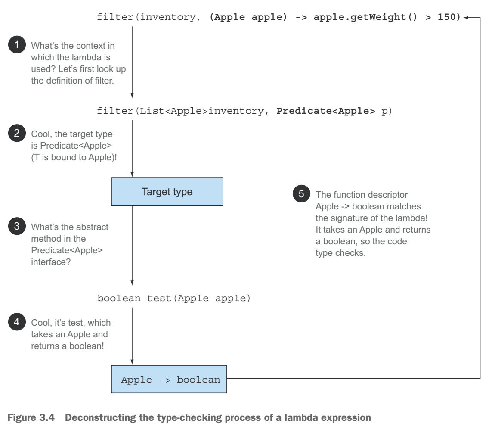
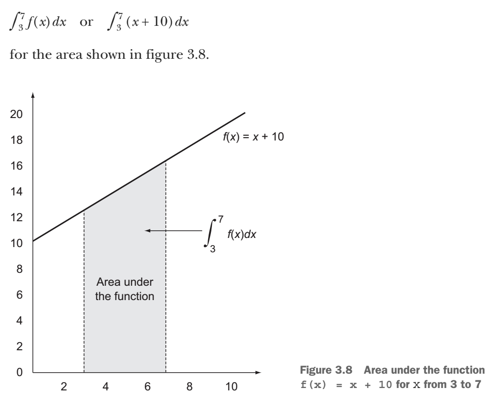

# Lambda Expression

## Lambda Style

- expression-style lambda: (parameters) -> expression
- block-style lambda: (parameters) -> { statements; }
- Based n the syntax rules just shown, which of the following are not valid expressions?

1. () -> {} // O usually called "burger lambda"
1. () -> "Ko" // O
1. () -> { return "Mario"; } // O
1. (Integer i) -> return "Alan" - i; // X
    - it's expression-style lambda, so you don't need return statement and semicolon: (Integer i) -> "Alan" - i
    - or you just need curly braces to change into block-style lambda: (Integer i) -> { return "Alan" - i; }
1. (String s) -> { "Iron Man"; } // X
    - if expression-style lambda: (String s) -> "Iron Man"
    - if block-style lambda: (String s) -> { return "Iron Man"; }

## Functional Interface

- _Functional interface_ is an interface that specifies exactly one abstract method.

> NOTE: Since java 8, interfaces can now also have _default methods_ (a method with a body that provides some default implementation for a method in case it isn't implemented by a class). An interface is still a functional interface if it has many default methods as long as it specifies _only one abstract method_.

- examples

```java
public interface Comparator<T> { int compare(T o1, T o2); } // java.util.Comparator
public interface Runnable { void run(); } // java.lang.Runnable
public interface ActionListener extends EventListener { void actionPerformed(ActionEvent e); } //java.awt.event.ActionListener
public interface Callable<V> { V call() throws Exception; } //java.util.concurrent.Callable
public interface PrivilegedAction<T> { T run(); } //java.security.PrivilegedAction
```

- Lambda expressions let you provide the implementation of the abstract method of a functional interface directly inline and _treat the whole expression as an instance of a functional interface_ (more technically speaking, an instance of a _concrete implementation_ of the functional interface).

- comparsion

```java
Runnable r1 = () -> System.out.println("Hello World 1"); // uses lambda expression
Runnable r2 = new Runnable() { // uses an anonymous class
    public void run() {
        System.out.println("Hello World 2");
    }
};
public static void process(Runnable r) { r.run(); }
process(r1); // Prints "Hello World 1"
process(r2); // Prints "Hello World 2"
process(() -> System.out.println("Hello World 3")); // Prints "Hello World 3" with a lambda passed directly
```

## Function Descriptor

- The signature of the abstract method of the functional interface describes the signature of the lambda expression. We call this abstract method a _function descriptor_.

## @FunctionalInterface

- This annotation is used to indicate that the interface is intended to be a functional interface and is therefore useful for documentation.
- In addition, the compiler will return a meaningful error if you define an interface using the _@FunctionalInterface_ annotation, and it isn't a functional interface.
- This annotation is not mandatory, but it's good practice to use it when an interface is designed for that purpose.

## java.util.function package

- Predicate\<T\>
  - This interface defines an abstract method named _test_ that accepts an object of generic type T and returns a _boolean_.
  - You might want to use this interface when you need to represent a boolean expression that uses an object of type T.
  - function descriptor: Predicate\<T\>.test(T t) -> boolean
- Consumer\<T\>
  - This interface defines an abstract method named _accept_ that takes an object of generic type T and returns no result (void).
  - You might use this interface when you need to access an object of type T and perform some operations on it.
  - function descriptor: Consumer\<T\>.accept(T t) -> void
  - example

    ```java
    @FunctionalInterface
    public interface Consumer<T> {
        void accept(T t);
    }
    public <T> void forEach(List<T> list, Consumer<T> c) {
        for(T t: list) {
            c.accept(t);
        }
    }
    forEach(Arrays.asList(1, 2, 3, 4, 5), (Integer i) -> System.out.println(i));
    ```

- Function\<T, R\>
  - This interface defines an abstract method named _apply_ that takes an object of generic type T as input and returns an object of generic type R.
  - You might use this interface when you need to define a lamabda that maps information from an input object to an output (ex. extracting the weight of an apple or mapping a string to its length).
  - function descriptor: Function\<T, R\>.apply(T t) -> R
  - example

    ```java
    @FunctionalInterface
    public interface Function<T, R> {
        R apply(T t);
    }
    public <T, R> List<R> map(List<T> list, Function<T, R> f) {
        List<R> result = new ArrayList<>();
        for(T t: list) {
            result.add(f.apply(t));
        }
        return result;
    }
    // [7, 2, 6]
    List<Integer> list = map(Arrays.asList("lambdas",  "in", "action"), (String s) -> s.length());
    ```

## Functional Interface Primitive Specialization

- Functional interfaces have generic parameters. Generic parameters can be bound only to reference types. This is due to how generics are internally implemented. As a result, in Java there's a mechanism to convert a primitive type into a corresponding reference type. This mechanism is called _boxing_. The opposite approach (converting reference type into a corresponding primitive type) si called _unboxing_. Java also has an _autoboxing_ mechanism to facilitate the task for programmers: boxing and unboxing operations are done automatically.
- But this comes with a performance cost. Boxed values are a wrapper around primitive types and are stored on the heap. Therefore, boxed values use more memory and require additional memory lookups to fetch the wrapped primitive value.
- Java 8 also added a specialized version of the functional interfaces in order to avoid autoboxing operations when the inputs or ouputs are primitives.
- Such as Predicate\<Integer\> -> IntPredicate
- Common Functional Interfaces added In Java 8


## Lambda type-checking process

> List\<Apple\> heavierThan150g = filter(inventory, (Apple apple) -> apple.getWeight() > 150);

The type-checking process is deconstructed as follows:

1. you look up the declaration of the _filter_ method.
1. it expects, as the second formal parameter, an object of type _Predicate\<Apple\> (the target type)
1. _Predicate\<Apple\> is a functional interface defining a single abstract method called test.
1. the _test_ method describes a function descriptor that accepts an _Apple_ and returns a _boolean_.
1. any argument to the _filter_ method needs to match this requirement.

※ Note that if the lambda expression was throwing an exception, then the declared _throws_ clause of the abstract method would also have to match.



## Same lambda expression, different functional interfaces

Because of the idea of _target typeing_, the same lambda exrpession can be associated with different functional interfaces if they have a compatible abstract method signature.

```java
Callable<Integer> c = () -> 42;
PrivilegedAction<Integer> p = () -> 42;
```

## Special void-compatibitliy rule

If a lamabda has a statement expression as its body, it's compatible with a function descriptor that returns _void_ (provided the parameter list is compatible, too).  
Ex, both of the following lines are legal even though the method _add_ of a _List_ returns a _boolean_ and not _void_ as expected in the _Consumer_ context (T -> void):

```java
// Predicate has a boolean return
Predicate<String> p = (String s) -> list.add(s);
// Consumer has a void return
Consumer<String> b = (String s) -> list.add(s);
```

## How to disambiguate lambda type

- Lambda expressions let you provide the implementation of the abstract method of a functional interface directly inline and _treat the whole expression as an instance of a functional interface_ (more technically speaking, an instance of a _concrete implementation_ of the functional interface).

- The next one cannot be complied.

```java
// The following is not valid
Object o = () -> { System.out.println("Tricky example"); };
```

- How can we fix it?
  - Solution 1

    ```java
    Runnable r = () -> { System.out.println("Tricky example"); };
    ```

  - Solution 2
    - You could also fix the problem by casting the lambda expression to Runnable, which explicitly provides a target type.
    - Because Lambda expression let you provide the implementation of the abstract method a Functional interface directly inline and treat the whole expression as an instance of a concrete implementation of the functional interface.

    ```java
    Object o = (Runnable) () -> { System.out.println("Tricky example"); };
    ```

    - `This technique can be useful in the context of overloading with a method taking two different functional interfaces that have the same function descriptor.` You can cast the lambda in order to explicitly disambiguate which method signature should be selected.

    ```java
    // the call exeucte(() -> {}) using the method execute would be ambiguous, because both Runnable and Action have the same function descriptor
    public void execute(Runnable runnable) {
        runnable.run();
    }
    public void execute(Action<T> action) {
        action.act();
    }
    @FunctionalInterface
    interface Action {
        void act();
    }
    // In this case, you can explicitly disambiguate the call by using a cast expression
    execute((Action) () -> {})
    ```

## Type inference

- The Java compiler deduces what fuctional interface to associate with a lambda expression from its surrounding context (the target type), meaning it can also deduce an appropriate signature for the lambda because the function descriptor is available through the target type.
- The benefit is that the complier has access to the types of the parameters of a lamabda expression, and the can be omitted in the lambda syntax.

```java
// No explicit type on the parameter apple
List<Apple> greenApples = filter(inventory, apple -> GREEN.equals(apple.getColor()));
```

- Note that sometimes it's more readable to include the types explicitly, and sometimes it's more readable to exclude them. It's up to developers' own choices about what makes their code more readable.

## Using local variables: capturing lambdas

- Lambda expression are also allowed to use `free variable` (variables that aren't the parameters and are defined in an outer scope) like anonymous class can. They're called `capturing lambdas`

```java
int portNumber = 1337;
Runnable r = () -> System.out.println(portNumber);
```

- Nonetheless, there's a small twist. There are some restrictions on what you can do with these variables. Lambdas are allowed to capture (to reference in their bodies) instance variables and static variables without restrictions.
- `But when local variables are captured, they have to be explicitly declared _final_ or be effectively _final_.` Lambda expressions can capture local variables that are assigned to only once. `(Note: capturing an instance variable can be seen as capturing the final local variable _this_.)`

```java
// The following has a complie error: local variable `portNumber` is not final or effectively final, which is assigned to twice:
int portNumber = 1337;
Runnable r = () -> System.out.println(portNumber);
portNumber = 31337;
```

### Restrictions on local variables

- Why local variables have those restrictions.
  - First, there's a key difference in how instance and local variables are implemented behind the scenes. `Instance variables are stored on the heap, whereas local variables live on the stack.`
    - `If a lmabda could access the local variable directly and the lambda was used in a thread, then the thread using the lambda could try to access the variable after the thread that allocated the variable had deallocated it.`
  - Second, this restriction also discourages typical imperative programming patterns (which prevent easy parallelization) that mutate an outer variable.
    - `Closure`: a closure is an instance of a function that can reference nonlogical variables of that function with no restrictions. Ex, a closure could be passed as argument to another function. It could also access and modify variables defined outside its scope.
    - Now, Java 8 lambdas and anonymous classes do something similar to closures: they can be passed as argument to methods and can access variables outside their scope
    - But they have a restriction:
      - `they can't modify the content of local variables of a method in which the lambda is defined. Those variables have to be implicitly final. It helps to think that lambdas close over _values_ rather than _variables_. This restriction exists because local variables live on the stack and are implicitly confined to the thread they're in. Allowing capture of mutable local vairables opens new thread-unsafe possibilities, which are undesirable (instance variables are fine because they live on the heap, which is shared across threads).`

## Method references

### Three main kinds of method references:

1. A method reference to a _static method_ (ex, the method _parseInt_ of _Integer_, written _Integer::parseInt_)
1. A method reference to an instance method of an arbitrary type (ex, the method _length_ of a _String_, written _String::length_)
    - you're refering to a method to an object that will be supplied as one of the parameters of the lambda
    - ex, (String s) -> s.toUpperCase() can be rewritten as _String::toUpperCase_
1. A method reference to an _instance method of an existing object or expression_ (ex, suppose you have a local variable _expensivceTransaction_ that holds an object of type _Transaction_, which supports an instance method _getValue_; you can write _expensiveTransaction::getValue_)
    - refers to a situation when you're calling a method in a lambda or an external object that already exists.
    - ex, () -> expensiveTransaction.getValue() can be rewritten as _expensiveTransaction::getValue_.
    - This is particulary useful when you need to pass around a method defined as a private helper.

    ```java
    private boolean isValidName(String s) {
      return Character.isUpperCase(s.charAt(0));
    }
    filter(words, this::isValidName) // Predicate<String>
    ```

- ex,

  ```java
  ToIntFunction<String> stringToInt = (String s) -> Integer.parseInt(s);
  ToIntFunction<String> stringToInt = Integer::parseInt;
  
  BiPredicate<List<String>, String> contains = (list, element) -> list.contains(element);
  BiPredicate<List<String>, String> contains = List::contains;

  Predicate<String> startsWithNumber = (String string) -> this.startsWithNumber(string);
  Predicate<String> startsWithNumber = this::startsWithNumber;
  ```

## Constructor references

- syntax: _ClassName::new_

```java
// zero argument
Supplier<Apple> c1 = Apple::new; // Constructor reference to the default Apple() constructor, which is the same as () -> new Apple();
Apple a1 = c1.get() // Calling Supplier's get method produces a new Apple.

// one argument
Function<Integer, Apple> c2 = Apple::new; // same as (weight) -> new Apple(weight)
Apple a2 = c2.apply(110);

//
List<Integer> weights = Arrays.asList(7, 3, 4, 10);
List<Apple> apples = map(weights, Apple::new);
public List<Apple> map(List<Integer> list, Function<Integer, Apple> f) {
  List<Apple> result = new ArrayList<>();
  for(Integer i: list) {
    result.add(f.apply(i)); // results in a List of apple with various weights
  }
  return result;
}

// two arguments
BiFunction<Color, Integer, Apple> c3 = Apple::new;
Apple a3 = c3.apply(GREEN, 110);

// three arguemtns
TriFunction<Integer, Integer, Integer, RGB> colorFactory = RGB::new;
public interface TriFunction<T, U, V, R> {
  R apply(T, U, V);
}


// you can use a Map to associate constructors with a string value.
static Map<String, Function<Integer, Fruit>> map = new HashMap<>();
// you can then create a method giveMeFruit that, given a String and an Integer, can create different types of fruits with different weights
static {
  map.put("apple", Apple::new);
  map.put("orange", Apple::new);
  // etc...
}
public static Fruit giveMeFruit(String fruit, Integer weight) {
  return map.get(fruit.toLowerCase()) // Get a Function<Integer, Fruit> from the map
            .apply(weight); // Function's apply method with an Integer weight parameter creates the requested Fruit.
}
```

## Methods to compose lambda expressions

- Many funtional interfaces such as _Comparator_, _Function_, and _Predicate_ that are used to pass lambda expressions provide methods that allow composition.
- In practice, it means you can combine several simple lambda expressions to build more complicated ones.
- You may wonder how it's possible that there are additional methods in a functional interface. (After all, this goes against the definition of a functional interface!)
- The trick is _default methods_ (they're not abstract methods).

### Composing Comparators

#### Comparing

- `Comparator.comparing` returns a Comparator based on a _Function_ that extracts a key for comparison as follows:

```java
Comparator<Apple> c = Comparator.comparing(Apple::getWeight);
```

#### Reversed order

- Comparator interface includes a default method `reversed` that reverses the ordering of a given comparator.

```java
// sorts by decreasing weight
inventory.sort(comparing(Apple::getWeight).reversed());
```

#### Changing comparators

- `thenComparing` method allows you to further refine the comparison.
- It takes a function as parameter (like the method `comparing`) and provides a second _Comparator_ if two objects are considered equal using the initial _Comparator_.

```java
inventory.sort(
  comparing(Apple::getWeight)
  .reversed() // sorts by decreasing weight
  .thenComparing(Apple::getCountry) // sorts further by country when two apples have same weight
);
```

### Composing Predicates

- The _Predicate_ interface includes three methods that let you reuse an existing _Predicate_ to create more complicated ones: `negate`, `and`, and `or`.
- `Note that the precedence of methods _and_ and _or_ in the chain is from left to right: there is no equivalent of bracketing.`
- ex,
  - _a.or(b).and(c)_ must be read as _(a || b) && c_.
  - a.and(b).or(c)_ must be read as _(a && b) || c_.

```java
// Produces the negation of the existing Predicate object redApple
Predicate<Apple> notRedApple = redApple.negate()

// Chains two predicates to produce another Predicate object
Predicate<Apple> redAndHeavyApple = redApple.and(apple -> apple.getWeight() > 150);

// Chains three predicates to construct a more complex Predicate object
Predicate<Apple> redAndHeavyAppleOrGreen =
  redApple.and(apple -> apple.getWeight() > 150)
          .or(apple -> GREEN.equals(apple.getColor()));
```

### Composing functions

- The _Function_ interface comes with two default methods for this, `andThen` and `compose`, which both return an instance of _Function_.
- `andThen`
  - returns a function that first applies a given function to an input and then applies another function to the result of that application.

  ```java
  Function<Integer, Integer> f = x -> x + 1;
  Function<Integer, Integer> g = x -> x * 2;
  Function<Integer, Integer> h = f.andThen(g); // In mathmatics, g(f(x)) or (g or f)(x)
  int result = h.apply(1); // returns 4
  ```

- `compose`
  - first applies the function given as argument to compose and then apply the function to the result.

  ```java
  Function<Integer, Integer> f = x -> x + 1;
  Function<Integer, Integer> g = x -> x * 2;
  Function<Integer, Integer> h = f.compose(g); // In mathmatics, f(g(x)) or (f or g)(x)
  int result = h.apply(1); // returns 3
  ```

## How to express mathmatics operation

### Calculate Trapezoid area



- In mathmatics: {(윗변 + 아랫변) * 높이}/2
- In Java 8:

  ```java
  public double integrate(DoubleFunction<Double> f, double a, double b) {
    return (f.apply(a) + f.apply(b)) * (b - a) / 2.0
  }
  // or using DoubleUnaryOperator, which also avoids boxing the result
  public double integrate(DoubleUnaryOperator f, double a, double b) {
    return (f.applyAsDouble(a) + f.applyAsDouble(b)) * (b - a) / 2.0
  }

  integrate((x) -> x + 10, 3, 7); // returns 60
  ```