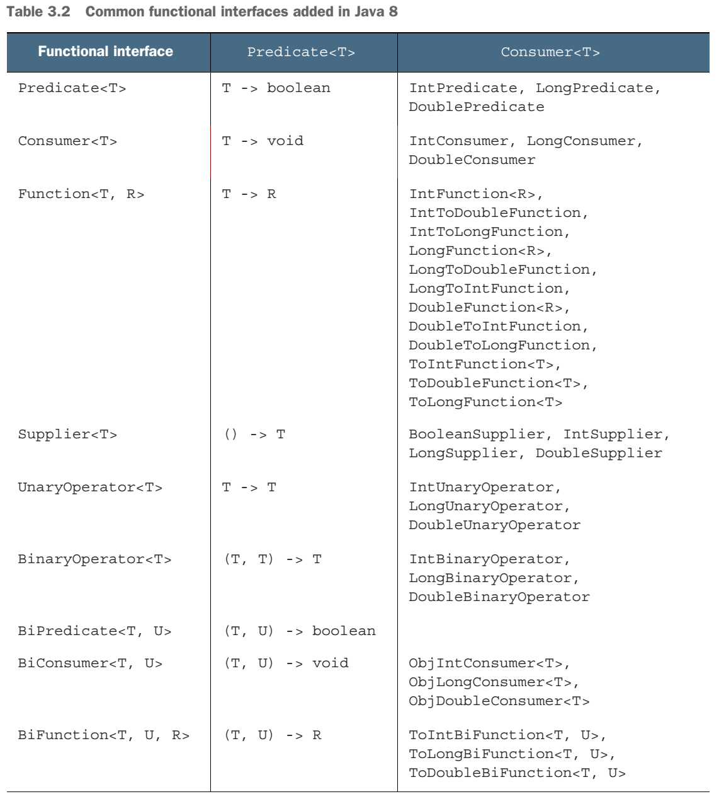

# Lambda Expression

## Lambda Style

- expression-style lambda: (parameters) -> expression
- block-style lambda: (parameters) -> { statements; }
- Based n the syntax rules just shown, which of the following are not valid expressions?

1. () -> {} // O usually called "burger lambda"
1. () -> "Ko" // O
1. () -> { return "Mario"; } // O
1. (Integer i) -> return "Alan" - i; // X
    - it's expression-style lambda, so you don't need return statement and semicolon: (Integer i) -> "Alan" - i
    - or you just need curly braces to change into block-style lambda: (Integer i) -> { return "Alan" - i; }
1. (String s) -> { "Iron Man"; } // X
    - if expression-style lambda: (String s) -> "Iron Man"
    - if block-style lambda: (String s) -> { return "Iron Man"; }

## Functional Interface

- _Functional interface_ is an interface that specifies exactly one abstract method.

> NOTE: Since java 8, interfaces can now also have _default methods_ (a method with a body that provides some default implementation for a method in case it isn't implemented by a class). An interface is still a functional interface if it has many default methods as long as it specifies _only one abstract method_.

- examples

```java
public interface Comparator<T> { int compare(T o1, T o2); } // java.util.Comparator
public interface Runnable { void run(); } // java.lang.Runnable
public interface ActionListener extends EventListener { void actionPerformed(ActionEvent e); } //java.awt.event.ActionListener
public interface Callable<V> { V call() throws Exception; } //java.util.concurrent.Callable
public interface PrivilegedAction<T> { T run(); } //java.security.PrivilegedAction
```

- Lambda expressions let you provide the implementation of the abstract method of a functional interface directly inline and _treat the whole expression as an instance of a functional interface_ (more technically speaking, an instance of a _concrete implementation_ of the functional interface).

- comparsion

```java
Runnable r1 = () -> System.out.println("Hello World 1"); // uses lambda expression
Runnable r2 = new Runnable() { // uses an anonymous class
    public void run() {
        System.out.println("Hello World 2");
    }
};
public static void process(Runnable r) { r.run(); }
process(r1); // Prints "Hello World 1"
process(r2); // Prints "Hello World 2"
process(() -> System.out.println("Hello World 3")); // Prints "Hello World 3" with a lambda passed directly
```

## Function Descriptor

- The signature of the abstract method of the functional interface describes the signature of the lambda expression. We call this abstract method a _function descriptor_.

## @FunctionalInterface

- This annotation is used to indicate that the interface is intended to be a functional interface and is therefore useful for documentation.
- In addition, the compiler will return a meaningful error if you define an interface using the _@FunctionalInterface_ annotation, and it isn't a functional interface.
- This annotation is not mandatory, but it's good practice to use it when an interface is designed for that purpose.

## java.util.function package

- Predicate\<T\>
    - This interface defines an abstract method named _test_ that accepts an object of generic type T and returns a _boolean_.
    - You might want to use this interface when you need to represent a boolean expression that uses an object of type T.
    - function descriptor: Predicate\<T\>.test(T t) -> boolean
- Consumer\<T\>
    - This interface defines an abstract method named _accept_ that takes an object of generic type T and returns no result (void).
    - You might use this interface when you need to access an object of type T and perform some operations on it.
    - function descriptor: Consumer\<T\>.accept(T t) -> void
    - example
        ```java
        @FunctionalInterface
        public interface Consumer<T> {
            void accept(T t);
        }
        public <T> void forEach(List<T> list, Consumer<T> c) {
            for(T t: list) {
                c.accept(t);
            }
        }
        forEach(Arrays.asList(1, 2, 3, 4, 5), (Integer i) -> System.out.println(i));
        ```
- Function\<T, R\>
    - This interface defines an abstract method named _apply_ that takes an object of generic type T as input and returns an object of generic type R.
    - You might use this interface when you need to define a lamabda that maps information from an input object to an output (ex. extracting the weight of an apple or mapping a string to its length).
    - function descriptor: Function\<T, R\>.apply(T t) -> R
    - example
        ```java
        @FunctionalInterface
        public interface Function<T, R> {
            R apply(T t);
        }
        public <T, R> List<R> map(List<T> list, Function<T, R> f) {
            List<R> result = new ArrayList<>();
            for(T t: list) {
                result.add(f.apply(t));
            }
            return result;
        }
        // [7, 2, 6]
        List<Integer> list = map(Arrays.asList("lambdas",  "in", "action"), (String s) -> s.length());
        ```

## Functional Interface Primitive Specialization

- Functional interfaces have generic parameters. Generic parameters can be bound only to reference types. This is due to how generics are internally implemented. As a result, in Java there's a mechanism to convert a primitive type into a corresponding reference type. This mechanism is called _boxing_. The opposite approach (converting reference type into a corresponding primitive type) si called _unboxing_. Java also has an _autoboxing_ mechanism to facilitate the task for programmers: boxing and unboxing operations are done automatically.
- But this comes with a performance cost. Boxed values are a wrapper around primitive types and are stored on the heap. Therefore, boxed values use more memory and require additional memory lookups to fetch the wrapped primitive value.
- Java 8 also added a specialized version of the functional interfaces in order to avoid autoboxing operations when the inputs or ouputs are primitives.
- Such as Predicate\<Integer\> -> IntPredicate
- Common Functional Interfaces added In Java 8

